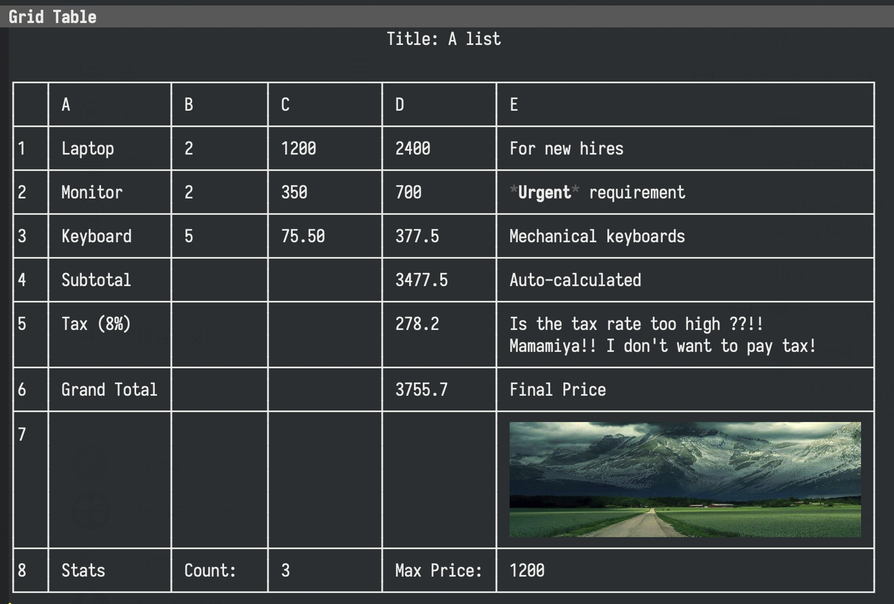

[English](README.md) | [中文](README_CN.md)

## grid-table

grid-table is a general grid table component for Emacs, supporting rich text and image rendering, formula calculation, interactive editing, sorting, persistence, and plugin extension. It can be embedded in Org/Markdown as "static preview + active editing".

### Features

- Rich text and images: simple Org-style markup and image inline (Unicode border preview) are supported in cells.
- Formula engine: =B2*C2, =SUM(D2:D4), =IF(A1>0, "Yes", "No"), etc.; supports cell/range references.
- Interactive editing: navigation, editing, inserting/deleting rows/columns, column width adaptation, column sorting.
- Persistence: .grid plain text format (with formulas); CSV plugin read/write.
- Plugin system: CSV data source, Org/Markdown static preview, easy to extend.

### Installation

1) Add the project and plugins directory to load-path
   (add-to-list 'load-path "/path/to/grid-table")
   (add-to-list 'load-path "/path/to/grid-table/plugins")
2) Load core and plugin system
   (require 'grid-table)
   (require 'grid-table-plugins)
   ;; or load by need:
   ;; (require 'grid-table-csv)
   ;; (require 'grid-table-org)
   ;; (require 'grid-table-markdown)

### Quick Start

- New: M-x grid-table-create
 - Open .grid: M-x grid-open (or M-x grid-table-find-file)
- Save as .grid: in grid-table buffer, C-c C-w or M-x grid-table-write-file
- Open CSV: M-x grid-table-find-file-csv

### Common Key Bindings (grid-table-mode)

- Navigation: n/p up/down, TAB/S-TAB left/right, g refresh
- Editing: e edit cell, C-c t edit title
- Row/column: C-c r a / C-c r d insert/delete row; C-c c a / C-c c d insert/delete column
- Sorting: C-c s sort current column ascending/descending
- File: C-c C-w save as .grid, C-c C-f open .grid; M-x grid-open open .grid directly

Note: inserting column is on the "current column right"; grid-table-insert-column-left supports left insertion. Deleting the 0th row (user-defined header) is protected; after deleting the last row, the cursor remains in the table.

### Formula

- Start with =: =B2*C2, =SUM(D2:D4), =IF(A1>0, "Yes", "No")
- Reference: cell A1, range A1:B5
- Built-in: SUM/AVERAGE/COUNT/MAX/MIN/IF

### Sorting

Execute C-c s on any data column, select ascending or descending to sort (user-defined header remains in the first row).

### Org Integration (special block)

- Insert block: M-x grid-table-org-insert-block (only :file)
- Refresh preview: M-x grid-table-org-refresh-block
- Open editing: M-x grid-table-org-open-block
Note: static preview is read-only; actual modification should be done in the dedicated table window.

### Markdown Integration (fenced block)

- Insert block: M-x grid-table-markdown-insert-block
- Refresh preview: M-x grid-table-markdown-refresh-block
- Open editing: M-x grid-table-markdown-open-block
Note: static preview is read-only; actual modification should be done in the dedicated table window.

### Persistence

.grid uses Lisp S-expressions to save: title, user-defined header, and all original values (including formulas).

### Data Source API (Overview)

Data source (hash table) common keys:
- Read/write: :get-row-count, :get-column-count, :get-raw-value-at, :get-computed-value-at, :set-raw-value-at
- Structure: :add-row, :delete-row, :add-column, :delete-column
- Other: :get-header-value, :set-header-value-at, :sort-by-column
See plugins/grid-table-csv.el for implementation of custom data source and registration.

### Roadmap

- Provider adapter (more stable Provider contract, compatible with current interface)
- Dependency graph and incremental recalculation, more formula functions (e.g. Lookup series)
- Org/Markdown advanced parameters (e.g. :range, :width, etc., optional)

### License and Contribution

Welcome to feedback and contribute plugins/features. If you have needs in data source or rendering, welcome to submit PR/Issue.

