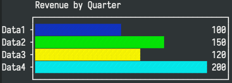
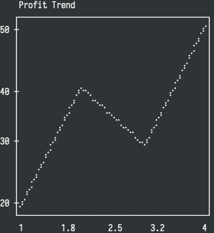
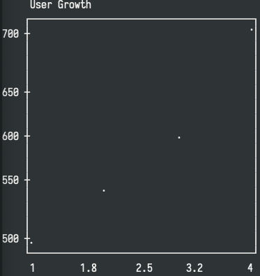
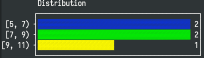
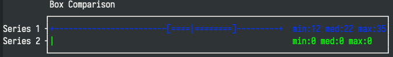
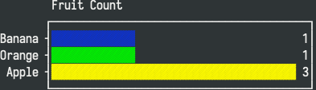
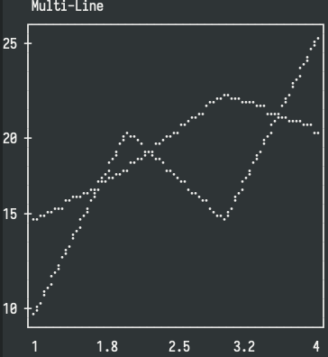

[English](README.md) | [中文](README_CN.md)

# 🎯 grid-table - Emacs Advanced Table System

<div align="center">


<p><i>A native table system for Emacs! Supports rich text, formula calculation, and plugin extensions 🔥</i></p>

</div>

## ✨ Features

<div align="center">

| Appearance                                                                            | Data Calculation                                                                                      | Extensibility                                                                                |
| ------------------------------------------------------------------------------------- | ----------------------------------------------------------------------------------------------------- | -------------------------------------------------------------------------------------------- |
| Rich Text Rendering<br/> Cell Images<br/> Adaptive Column Widths<br/> Unicode Borders | Formula Engine (Excel Style)<br/>📍 Cell References<br/> Real-time Calculation<br/> Elisp Expressions | Plugin Architecture<br/>🔗 Multiple Data Sources<br/> Format Export<br/>🔧 Custom Extensions |

</div>

### 🚀 Core Capabilities

- **Markdown Style Markup** - Write resume summaries in cells
- **Image Visualization** - Display images directly in tables!
- **Excel-Level Formulas** - `=B2*C2· =SUM(A1:A10)· =IF(...)`
- **Elisp Super Formulas** - Powerful `=elisp:(cell"A1")` expressions
- **Real-time Preview** - "Static Preview + Dynamic Editing" in Org/Markdown

## 🚀 30 Seconds to Get Started

### 📦 1. Installation and Configuration

#### 🎯 Recommended: Use `use-package`

```elisp
;; 🚄 One-stop configuration - Recommended!
(use-package grid-table
  :load-path ("/path/to/grid-table" "/path/to/grid-table/plugins")
  :config
  (require 'grid-table)
  (require 'grid-table-plugins)

  ;; 📁 Custom save directory
  (setq grid-table-default-save-directory "~/Documents/表格/")

  ;; 🖼️ Image display optimization
  (setq grid-table-image-target-char-height 8)
  (setq grid-table-image-max-width-ratio 0.9))
```

#### 📋 Traditional Way

```elisp
;; 📍 Manual configuration path
(add-to-list 'load-path "/path/to/grid-table")
(add-to-list 'load-path "/path/to/grid-table/plugins")

;; 🎯 Load on demand
(require 'grid-table)          ;; Core functionality
(require 'grid-table-plugins)  ;; Plugin system
(require 'grid-table-csv)      ;; CSV support
(require 'grid-table-org)      ;; Org integration
(require 'grid-table-markdown) ;; Markdown integration
```

## 📋 Operation Quick Reference

### File Operations Overview

| 🎯 Action | 📝 Command                     | 🔑 Shortcut | ⚡ Tip                |
| --------- | ------------------------------ | ----------- | --------------------- |
| New       | `M-x grid-table-create`        | -           | Create a blank table  |
| Open      | `M-x grid-table-find-file`     | `C-c C-f`   | Open .grid file       |
| Save      | -                              | `C-c C-w`   | Smart path suggestion |
| CSV       | `M-x grid-table-find-file-csv` | -           | Directly read CSV     |

### Editing Operations Quick Reference

| 🎯 Action                | 🤞 Shortcut        | 📝 Effect                        | ⚠️ Note                                |
| ------------------------ | ------------------ | -------------------------------- | -------------------------------------- |
| **✏️ Basic Editing**     |                    |                                  |                                        |
| Cell Editing             | `e` or right-click | Enter edit mode                  | Cell focus                             |
| Title Editing            | `C-c t`            | Modify table title               | Global display                         |
| **➕ Row Operations**    |                    |                                  |                                        |
| Insert Row Below         | `C-c r a`          | Create new row below current row | Smart format inheritance               |
| Delete Current Row       | `C-c r d`          | Delete entire row                | ⚠️ **Table headers cannot be deleted** |
| **➕ Column Operations** |                    |                                  |                                        |
| Insert Column to Right   | `C-c c a`          | Create new blank column          | Auto-adjust width                      |
| Delete Current Column    | `C-c c d`          | Delete entire column             | Clear data                             |

### Navigation Control Diagram

| 🎯 Direction | ⌨️ Key         | 🖱️ Operation |
| ------------ | -------------- | ------------ |
| ⬆️ Up        | `p` or `↑`     | Previous row |
| ⬇️ Down      | `n` or `↓`     | Next row     |
| ⬅️ Left      | `S-TAB` or `←` | Left cell    |
| ➡️ Right     | `TAB` or `→`   | Right cell   |
| 🔄 Refresh   | `g`            | Re-render    |

**🎯 Tip**: Use `n`/`p` for vertical movement, `TAB` for horizontal movement

## 🧮 Formula Complete Guide

### Basic Syntax Comparison Table

| 🎯 Type     | 📝 Syntax         | 📋 Example         | 💡 Description        |
| ----------- | ----------------- | ------------------ | --------------------- |
| 📍 Cell     | `=A1`、`=B2`      | `=B2*C2`           | Relative reference    |
| 📊 Range    | `=RANGE(A1:B5)`   | `=SUM(A1:A10)`     | Continuous block      |
| ✨ Function | `=FUNCTION(args)` | `=AVERAGE(B2:B10)` | Built-in function set |

### Official Built-in Function List

| 📈 Math Functions | 📊 Statistical Functions | 🎯 Conditional Functions | 🎨 Text Functions    |
| ----------------- | ------------------------ | ------------------------ | -------------------- |
| `SUM` Sum         | `AVERAGE` Average        | `IF` Conditional         | `CONCAT` Concatenate |
| `PRODUCT` Product | `COUNT` Count            | `AND/OR` Logical         | `LEFT/RIGHT` Slice   |
| `MOD` Modulus     | `MAX/MIN` Extremes       | `NOT` Invert             | `LEN` Length         |

### Elisp Formula Advanced Techniques (Expert Level)

```elisp
=elisp:(+ 1 2 3)                      ; 🎯 Basic calculation
=elisp:(+ (cell "A1") (cell "B2"))     ; 📍 Cell reference
=elisp:(format "%.2f%%" (* 100 (cell "完成率"))) ; 🎨 Formatted string
=elisp:(let ((x (cell "B2"))) (* x x)) ; 🔧 Complex logic
```

_This feature is turned off by default._ For more detailed guidance, please refer to [ELISP_FORMULA_GUIDE.md](docs/ELISP_FORMULA_GUIDE.md).

> ⚠️ **Security Warning**: `=elisp:` executes arbitrary Elisp code! **Only use in fully trusted documents**  
> 🔒 **Suggestion**: Verify external files are safe and reliable through `M-x checkdoc`

## 📊 Chart Visualization Guide

grid-table provides built-in chart functions that render ASCII/Unicode charts directly in cells. Charts use high-resolution Braille canvas for beautiful terminal-based visualizations.

### Available Chart Functions

| 📊 Chart Type | 📝 Function  | 💡 Description                   |
| ------------- | ------------ | -------------------------------- |
| Bar Chart     | `BARPLOT`    | Horizontal bar chart             |
| Column Chart  | `COLUMNPLOT` | Vertical column chart            |
| Line Chart    | `LINEPLOT`   | Line plot with Braille rendering |
| Scatter Plot  | `SCATTER`    | Scatter plot visualization       |
| Histogram     | `HISTOGRAM`  | Distribution histogram           |
| Box Plot      | `BOXPLOT`    | Statistical box plot             |
| Density       | `DENSITY`    | KDE density curve                |
| Count         | `COUNT`      | Frequency count chart            |
| Multi-line    | `MULTILINE`  | Multiple series line chart       |
| Sparkline     | `SPARKLINE`  | Compact inline trend             |

### Chart Syntax Examples

#### BARPLOT - Horizontal Bar Chart

```
=BARPLOT(labels, values, [title], [width])
```

**Example:**

```
=BARPLOT(A1:A4, B1:B4, "Revenue by Quarter", 50)
```

#### COLUMNPLOT - Vertical Column Chart

```
=COLUMNPLOT(labels, values, [title], [width], [height])
```

**Example:**

```
=COLUMNPLOT(A1:A4, B1:B4, "Monthly Sales", 40, 15)
```

#### LINEPLOT - Line Chart

```
=LINEPLOT(x-data, y-data, [title], [width], [height])
```

**Example:**

```
=LINEPLOT(A1:A10, B1:B10, "Trend Analysis")
```

#### HISTOGRAM - Distribution Histogram

```
=HISTOGRAM(values, [nbins], [title], [width])
```

**Example:**

```
=HISTOGRAM(C1:C100, 10, "Score Distribution")
```

#### BOXPLOT - Statistical Box Plot

```
=BOXPLOT(series1, series2, ..., [title], [width])
```

**Example:**

```
=BOXPLOT(A1:A20, B1:B20, "Comparison", 60)
```

#### SPARKLINE - Compact Trend Line

```
=SPARKLINE(data)
=SPARKLINE(val1, val2, val3, ...)
```

**Example:**

```
=SPARKLINE(A1:A10)
=SPARKLINE(10, 15, 13, 17, 19)
```

### Chart Preview Gallery

Add demo screenshots under `pictures/` and they will render here.

| Type | Preview |
| --- | --- |
| `BARPLOT` |  |
| `COLUMNPLOT` |  |
| `LINEPLOT` |  |
| `SCATTER` |  |
| `HISTOGRAM` |  |
| `BOXPLOT` |  |
| `DENSITY` |  |
| `COUNT` |  |
| `MULTILINE` |  |
| `SPARKLINE` |  |

### Chart Demo File

See `examples/chart-gallery.grid` for a complete demonstration:

```elisp
(:title "Chart Gallery"
 :headers ("Type" "Data1" "Data2" "Data3" "Data4" "Chart")
 :rows (
   ("Revenue" "100" "150" "120" "200" "=BARPLOT(B1:E1, B2:E2, \"Revenue\")")
   ("Trend"   "20"  "40"  "30"  "50"  "=LINEPLOT(B1:E1, B3:E3, \"Trend\")")
   ("Mini"    "10"  "12"  "11"  "15"  "=SPARKLINE(B4:E4)")
 ))
```

## 🔗 Format Integration Guide

### Org Mode Deep Integration

```org
#+BEGIN: grid-table
#+OPTIONS: :file "~/project/data.grid"

here display table preview (static preview)

#+END:
```

**three steps**:

1. `M-x grid-table-org-insert-block` - insert grid-table block (static preview)
2. `M-x grid-table-org-refresh-block` - refresh grid-table block (dynamic preview)
3. `M-x grid-table-org-open-block` - open grid-table block (edit mode)

### Markdown GitHub-style

````markdown
```grid-table
:file ~/project/data.grid
```
````

here display table preview (static preview)

```

```

</markdown>

### reStructuredText support

| 🎯 scenario               | 📝 command                                  | 📤 result                 |
| ------------------------- | ------------------------------------------- | ------------------------- |
| from grid export          | `M-x grid-table-export-as-rst`              | 📄 standard RST format    |
| insert existing grid file | `M-x grid-table-rst-insert-table-from-file` | 🔗 smart path recognition |

## Core Technology Principles

### Data Flow Architecture Diagram

```
User Interface ←→ grid-table.el ←→ Core Engine
                ↓                ↓
          data-source API ← grid-data-model
                ↓                ↓
        CSV Plugin ←→ Org Plugin ←→ Custom Data Sources
```

### Core API Quick Reference Table

| 🤝 interface type        | 🔗 key                     | 📝 return value type | 💡 key purpose             |
| ------------------------ | -------------------------- | -------------------- | -------------------------- |
| **data acquisition**     |                            |                      |                            |
| raw value                | `:get-raw-value-at`        | String               | value before formula       |
| computed value           | `:get-computed-value-at`   | Any                  | formula calculation result |
| **structure management** |                            |                      |                            |
| dimension query          | `:get-row-count`           | Integer              | import data statistics     |
| new unit                 | `:add-row` / `:add-column` | Boolean              | success/failure            |
| **extension interface**  |                            |                      |                            |
| load interface           | `:load-from-file`          | Object               | custom file support        |
| save interface           | `:save-to-file`            | Boolean              | format export logic        |

## 📁 code organization structure

```
grid-table/                    # project root directory
├── grid-table.el              # main entry + UI rendering
├── grid-data-model.el         # data model core
├── grid-data-source.el        # data source abstraction
├── grid-table-api.el          # public API
├── grid-table-calc.el         # formula calculation engine
├── grid-table-chart.el        # chart visualization engine
├── grid-table-nav.el          # navigation control logic
├── grid-table-parser.el       # text parsing tool
└── grid-table-persistence.el  # persistence support
├── plugins/                   # plugin extension system
│   ├── grid-table-csv.el      # CSV format support
│   ├── grid-table-org.el      # Org mode integration
│   ├── grid-table-markdown.el # Markdown integration
│   ├── grid-table-rst.el      # reStructuredText export
│   └── grid-table-example-plugin.el # plugin development example
├── examples/                  # example files
│   └── chart-gallery.grid     # chart demonstration
├── docs/                      # technical documentation
│   ├── ELISP_FORMULA_GUIDE.md     # formula development guide
│   └── PLUGIN_DEVELOPMENT.md      # plugin development manual
└── pictures/                  # product screenshots and demonstrations
```

## 🤝 how to contribute

### ⚡ plugin development quick start

#### 3 types of plugins (1 minute to master)

| 🎯 type                   | 📝 function description        | 🎯 applicable scenario              |
| ------------------------- | ------------------------------ | ----------------------------------- |
| 🎨 **cell renderer**      | custom cell display appearance | progress bar, currency format, etc. |
| 📊 **data source plugin** | support new file formats       | JSON, Excel reading                 |
| ⚡ **function plugin**    | add new function commands      | data export, chart generation       |

#### quick start template (copy and use)

```elisp
;;; my-plugin.el --- quick template -*- lexical-binding: t -*-
(require 'grid-table-plugins)

;; simple currency formatter
(defun my-currency-renderer (value &optional cell-props)
  "Currency formatter, convert number to ¥XX.XX format"
  (if (and value (stringp value))
      (let ((num (string-to-number value)))
        (format "¥%.2f" num))
    ""))

;; register renderer (done!)
(defun my-plugin-init ()
  (grid-table-register-cell-renderer 'currency #'my-currency-renderer)
  (grid-table-register-plugin 'my-plugin))

(my-plugin-init)
(provide 'my-plugin)
```

> 📚 **complete development guide**→ [plugin development manual](docs/PLUGIN_DEVELOPMENT.md) (from入门 to expert level)

### 🐛 quick feedback path

- 📧 **bug report** → [GitHub Issues](https://github.com/your-repo/issues)
- ✨ **feature suggestion** → [discussion forum](https://github.com/your-repo/discussions)
- 🔧 **plugin contribution** → [plugin development manual](docs/PLUGIN_DEVELOPMENT.md)

### 🎯 community contribution direction

| 🎯 type                | 📋 demand description            | 🏷️ tag                  |
| ---------------------- | -------------------------------- | ----------------------- |
| **data source plugin** | Excel/JSON/Multiple data sources | `enhancement`, `plugin` |
| **format export**      | LaTeX/ASCII/HTML/JSON export     | `extending`, `format`   |
| **theme plugin**       | dark mode                        | `UI/UX`, `theme`        |
| **chart plugin**       | data visualization               | `visualization`         |

---

<div align="center">

**Built with ❤️ for the Emacs community**

_Since 2025, supporting efficient productivity workflows_

🤝 **[→ Join the developer community ←](https://github.com/yibie/grid-table/discussions)**

</div>
